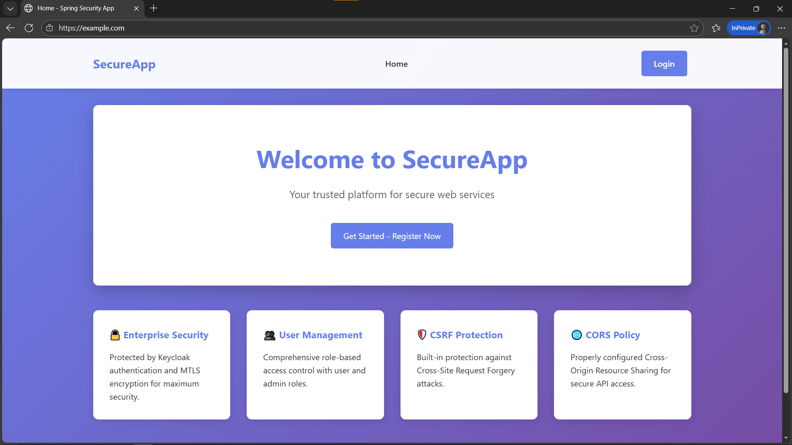
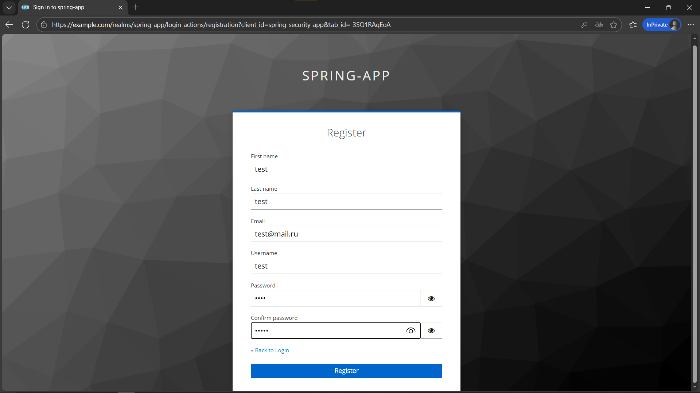
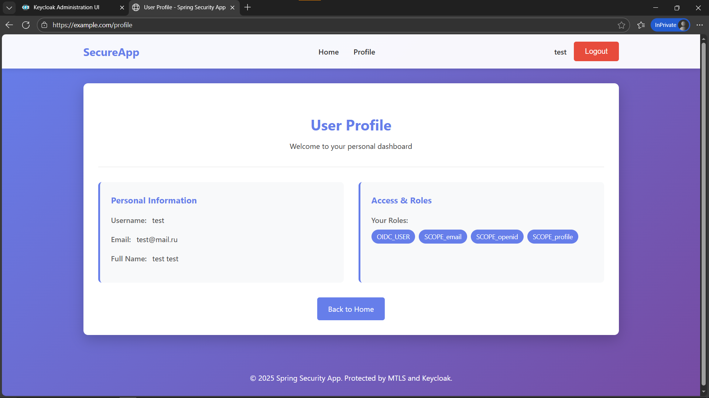
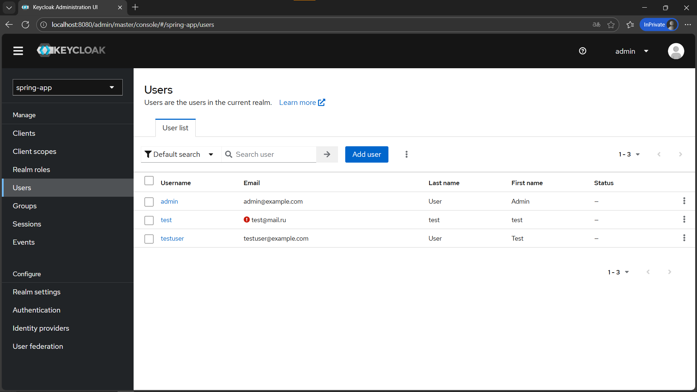
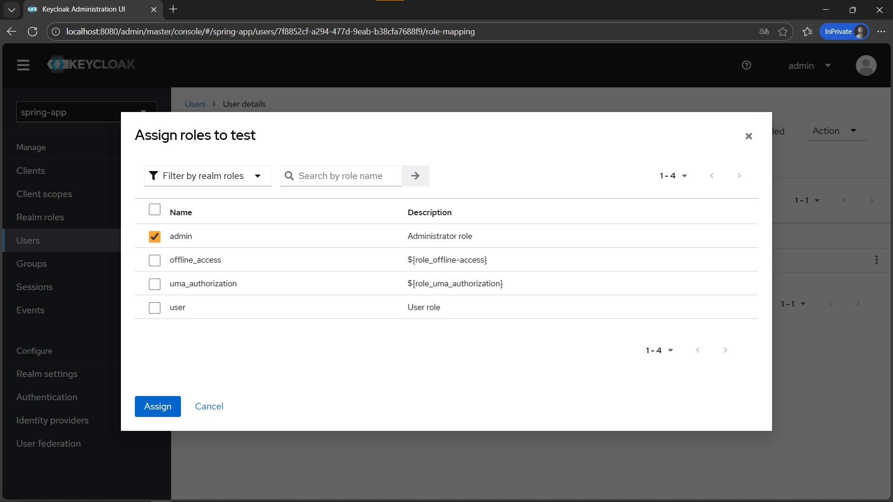
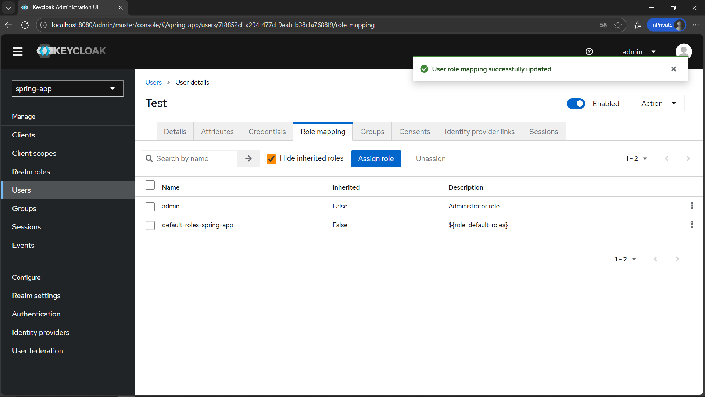
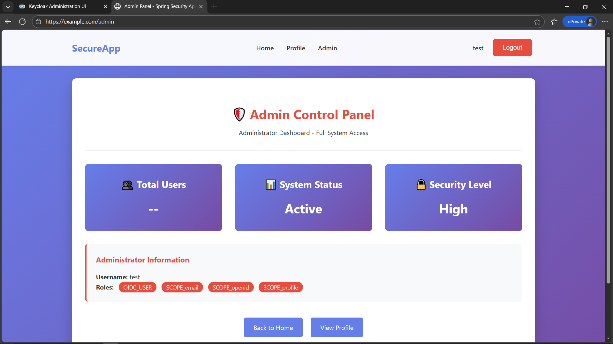

## Быстрый старт

```bash
# 1. Генерация сертификатов
./generate-certs.sh  # Linux/Mac
# или
generate-certs.bat   # Windows

# 2. Добавить в hosts файл
# Linux/Mac: /etc/hosts
# Windows: C:\Windows\System32\drivers\etc\hosts
127.0.0.1 example.com
127.0.0.1 api.example.com

# 3. Запустить всё
docker-compose up

# 4. Установить сертификаты в браузер (см. раздел "Установка сертификатов")

# 5. Открыть https://example.com
```

## Установка и запуск

### Шаг 1: Генерация сертификатов

**Linux/Mac:**
```bash
chmod +x generate-certs.sh
./generate-certs.sh
```

**Windows:**
```cmd
generate-certs.bat
```

Будут созданы:
- `certs/ca.crt` - корневой CA сертификат
- `certs/server.crt`, `certs/server.key` - серверные сертификаты
- `certs/client.p12` - клиентский сертификат (пароль: `changeit`)

### Шаг 2: Настройка DNS

Добавьте в hosts файл:

**Linux/Mac:**
```bash
sudo nano /etc/hosts
```

**Windows (PowerShell от администратора):**
```powershell
notepad C:\Windows\System32\drivers\etc\hosts
```

Добавьте строки:
```
127.0.0.1 example.com
127.0.0.1 api.example.com
```

### Шаг 3: Запуск сервисов

```bash
docker-compose up
```

### Шаг 4: Установка сертификатов в браузер

#### Chrome/Edge:
1. Настройки → Конфиденциальность → Безопасность → Управление сертификатами
2. **Доверенные корневые центры** → Импорт → `certs/ca.crt` → Доверять для веб-сайтов
3. **Личные** → Импорт → `certs/client.p12` (пароль: `changeit`)

### Шаг 5: Доступ к приложению

Откройте https://example.com в браузере. Браузер запросит выбор клиентского сертификата - выберите "Client Certificate".


## Функциональность

### Страницы приложения

| URL | Доступ | Описание |
|-----|--------|----------|
| `/` или `/home` | Все | Главная страница (лендинг) |
| `/public` | Все | Публичная информация |
| `/profile` | USER, ADMIN | Личный кабинет пользователя |
| `/admin` | ADMIN | Панель администратора |

### Учетные записи

#### Keycloak Admin
- URL: http://localhost:8080
- Логин: `admin`
- Пароль: `admin`

#### Пользователи приложения

| Логин | Пароль | Роли | Доступ |
|-------|--------|------|--------|
| testuser | testuser123 | USER | Профиль |
| admin | admin123 | USER, ADMIN | Профиль + Админка |

### Демонстрация работы

Перейдем в наше приложение по адресу https://example.com/ в браузере с импортированными сертификатами



Далее зарегистрируем нового пользователя с помощью keycloak



После войдем в приложение с новым пользователем


Попадаем в профиль пользователя



Добавим роль администратора для пользователя







Перезайдем в приложение с новыми ролями



Появилась новая страница!

## Тестирование

### Автоматическое тестирование

Запустите скрипт проверки:

```bash
./verify.sh  # Linux/Mac
```

```cmd
verify.bat   # Windows
```

Скрипт проверит:
- ✅ Сборку приложения
- ✅ Запуск Docker сервисов
- ✅ MTLS (403 без сертификата, 200 с сертификатом)
- ✅ Логирование DN сертификата в NGINX
- ✅ Доступность Keycloak
- ✅ Работу health endpoints

### Ручное тестирование

#### Тест 1: MTLS без сертификата (должен вернуть 403)
```bash
curl -k https://example.com
```
**Ожидается:** 403 Forbidden

#### Тест 2: MTLS с сертификатом (должен вернуть 200)
```bash
curl -k --cert certs/client.crt --key certs/client.key https://example.com
```
**Ожидается:** 200 OK с HTML

#### Тест 3: Проверка DN в логах NGINX
```bash
docker-compose exec nginx tail /var/log/nginx/example.com.access.log
```
**Ожидается:** В логах присутствует `SSL_CLIENT_S_DN="CN=Client Certificate..."`

#### Тест 4: Публичный доступ
Откройте https://example.com - должна загрузиться главная страница без входа.

#### Тест 5: Защищенные страницы
Откройте https://example.com/profile - должен перенаправить на Keycloak для входа.

#### Тест 6: Роли
- Войдите как `testuser` → попробуйте `/admin` → 403 Forbidden
- Войдите как `admin` → откройте `/admin` → доступ разрешен
